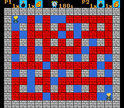

# Bomb'n'Break for SNES

40 years since the NES came out. Celebrating this anniversary and as I found a nice framework to code for
the SNES in C I tried to write a little game myself.



# Building

Dependencies:
- [pvsneslib](https://github.com/alekmaul/pvsneslib)
- Unix shell
- Python 3.x
- make

Make sure to have the environment variable `PVSNESLIB_HOME` point to the installation directory of pvsneslib.

Default debug build:
```sh
make
```

## Build Options

|Option     |Description                                             |
|-----------|--------------------------------------------------------|
|NDEBUG=1   |Disable debug information (i.e. release build).         |
|USE_NTSC=1 |Assume NTSC instead of PAL (default).                   |
|HAS_BGM=1  |Enable background music (requires `res/bgm1.it`)        |
|HAS_SFX=1  |Enable explosion sound effect (requires `res/sfx1.wav`) |

# BGM/SFX

For private means I am using the explosion effect from BlitzBlaster
by Sergio Marcello and the track Jazzy Nork by Crystal Symphonies
which are not included here due to missing license agreements.

You can include your own sounds performing the following steps.

## Adding explosion SFX

- Create a [WAV file](https://en.wikipedia.org/wiki/WAV) with PCM, 11025 Hz and 8-bits per sample.
- Store the file in `res/sfx1.wav`.
- Adjust the size passed to `spcAllocateSoundRegion()` in `main.c`.
- Run `make` with `HAS_SFX=1` as command-line parameter.

## Adding BGM

- Create an [IT file](https://de.wikipedia.org/wiki/Impulse_Tracker) with instruments
  instead of samples using 8-bits per sample. I recommend using [Schism Tracker](https://schismtracker.org/).
- Store the file in `res/bgm1.it`.
- Adjust the number of used soundbanks with `spcSetBank()` in `main.c` (using reverse order).
- Run `make` with `HAS_BGM=1` as command-line parameter.

# Development

The code is written in C and [65816 assembly](https://github.com/nArnoSNES/wla-dx-65816).  
Many considerations have been done to avoid performance issues. E.g. the linear random number
generator is written in assembly. This chapter summaries some development insights and design
considerations.

## Tools

Recommended tools for development:

- [pvsneslib](https://github.com/alekmaul/pvsneslib)
- [bsnes](https://github.com/bsnes-emu/bsnes) or [Mesen](https://www.mesen.ca)
- [M1TE](https://github.com/nesdoug/M1TE2) (Windows)
- [Schism Tracker](https://schismtracker.org/)
- [Gimp](https://www.gimp.org/)
- [Photoshop](https://www.adobe.com/products/photoshop.html)
- [MSYS2](https://www.msys2.org/) (Windows)

Note that `smconv` crashed trying to convert the IT file written by [OpenMPT](https://openmpt.org/) for me.

## References

- [65816 Reference](https://wiki.superfamicom.org/65816-reference)
- [SNES Assembly](https://ersanio.gitbook.io/assembly-for-the-snes/)
- [WLA-DX-65816](https://github.com/nArnoSNES/wla-dx-65816)
- [SNES Development Wiki](https://wiki.superfamicom.org/)
- [Hardware Registers](https://media.smwcentral.net/Ersanio/SMWCstuff/Advanced%20documentation/qsnesdoc.html)
- [DMA & HDMA Explained](https://www.youtube.com/watch?v=K7gWmdgXPgk)

## Background, Foreground, Sprites

The background plane is separated in a background (`BG_NR`) and foreground (`FG_NR`) layer.
The identifiers are chosen according to the [background priorities in mode 1](https://wiki.superfamicom.org/backgrounds).
Both layers consist of 64x32 tiles á 8x8 pixels. The window resolution is only 32x28 tiles
and 32x32 tiles are used per page in the SNES to simplifies various operations. Two pages
are used to make the slide-in/slide-out effect. The hidden page is being replaced before the
next one is being shown.  
The tiles form the title screen, options screen and the game screen completely. Only the
player characters are being drawn using sprites.  
The title screen and option screen are being modified directly in VRAM whereas the game screen
uses the WRAM buffers `gameFieldLow` for tile indices and and `gameFieldHigh` for attribute
data. These are being updated after each VBlank if `refreshGameScreenLow`, respective
`refreshGameScreenHigh` are set `true` using DMA transfer. This avoids graphic glitches.
The additional arrays `aniField` and `ttlField` are being used to perform the animation of
explosion and breaking walls correctly. The animation data for the bombs is being handled in
the `bombList` array associated to `p1` and `p2`.  
Note that `fieldElemIndex` and `fTypeMap` are being used to speed-up animation and collision checks.

The following table shows how the tile maps, tiles and palettes are being used (see also `src/data.asm`).

|File        |Identifiers               |Type      |Use in/as                                          |
|------------|--------------------------|----------|---------------------------------------------------|
|bg1.chr     |bg1Tiles, bg1TilesEnd     |tiles     |Title screen background tiles.                     |
|bg1.map     |bg1Map, bg1MapEnd         |tile map  |Title screen background map (title/start).         |
|bg1.pal     |bg1Pal, bg1PalEnd         |palette   |Title screen background palette number #1.         |
|bg2.map     |bg2Map, bg2MapEnd         |tile map  |Game screen background map.                        |
|fg1.chr     |fg1Tiles, fg1TilesEnd     |tiles     |Title screen foreground tiles.                     |
|fg1.map     |fg1Map, fg1MapEnd         |tile map  |Title screen foreground map (credits).             |
|fg1.pal     |fg1Pal, fg1PalEnd         |palette   |Title screen foreground palette number #2.         |
|fg2.chr     |fg2Tiles, fg2TilesEnd     |tiles     |Option/game screen foreground tiles.               |
|fg2.pal     |fg2Pal, fg2PalEnd         |palette   |Option/game screen foreground palette number #3.   |
|options.map |optionsMap, optionsMapEnd |tile map  |Option screen foreground map with the options.     |
|field.map   |fieldMap, fieldMapEnd     |tile map  |Initial game screen foreground map with the field. |
|p12.chr     |p12Tiles, p12TilesEnd     |tiles     |Player 1 and 2 sprite tiles.                       |
|p12.pal     |p12Pal, p12PalEnd         |palettes  |Player 1 (#4) and 2 (#5) sprite palettes.          |

`options.map` and `field.map` are using the tiles and palette of `fg2.chr` with priority flag set to 1.  
`fg2.chr` also contains the ASCII characters used to display the numeric values on the option and game screen.

## Time Handling

NTSC (60 Hz) or PAL (50 Hz) is being selected via build switch. Knowing their frame rate it is easy
to use VBlanks to count the time. `FP10HZ` is being defined accordingly to simplify this task. The macro
holds the number of frames per 1/10s. All animations are based on this frequency of 10 Hz.  
The time base is being used in `clickDelay()` to avoid fast value changes in the option screen and
for the animations and game time handling in `handleGame()`. The speed of the slide-in/slide-out animation
is determined from the value of `SLIDE_SPEED` which is also derived from the video mode.  
See also the global variables `framesUntil10Hz`, `counter10Hz` and `untilSecond` used for global time management.

## Collision Detection

Collision detection is simply done via bounding box using the 4 corners of the player sprite defined via
`P_LEFT`, `P_RIGHT`, `P_TOP` and `P_BOTTOM` with `P_MID_X` and `P_MID_Y` forming its center used for bomb
placement. It is bing checked whether one of these corners falls within a given game field or not.
To detect whether the most recently dropped bomb field has been left, it is being checked whether the
16x16 fields around these four corners contain the dropped bomb field or not.
No hitmask or other technique is being used. Most of the collision events are being tested using the game
field coordinates.

## Variable Storage

Most of the variables are being stored as global variables due to the fact that the used CPU provides
only a 256 byte stack and the compiler offers no software stack implementation.
Some of these variables are used as loop invariant or in place of local variables. Care has been taken
that no inner function accidentally overwrites global variables used by the calling functions.
Global variables in question are: `i`, `j`, `j2`, `k`, `m`, `dx`, `dy`, `ds`, `x`, `y`, `x1`, `y1`,
`x2`, `y2`, `field`, `attrField` and `b`.

## Screen Handling

Each screen has its one set of associated background/foreground tiles, tile maps and palettes. Some
are shared between these. A handler is defined for each screen. It handles the user interaction and
graphic output. All screen handlers are stored in `screenHandler` and being access in the main loop
of `main()` via the global variable `screen`. The enumeration values `S_TITLE`, `S_OPTIONS`, `S_GAME`,
`S_PAUSE` and `S_WINNER` correspond to the handlers of the same index in `screenHandler` for fast
selection. The values of the global variables `pad0` and `pad1` are updated before each call of the
screen handlers followed by a call to `WaitForVBlank()` to process the next frame.

# Debug

`debug.h` contains functions to create software breakpoints with assertions. These are used in various
places in the game and can be disabled via makefile parameter `NDEBUG=1`.

The software breakpoints are triggered via opcode `BRK`. Previously, the global pointer `debugMessage`
is set to point to the assertion string.

Use an emulator like [bsnes](https://github.com/bsnes-emu/bsnes) to debug with software breakpoints and
check the memory for the set address to see the failing assertion message.

# Known Issues

Sometimes the game freezes if it was built with `HAS_SFX=1` due to a race condition and/or memory bug in
the audio driver of pvsneslib. See [issue #226](https://github.com/alekmaul/pvsneslib/issues/226).

# License

All graphics and sounds are licensed under [CC BY-SA 4.0](https://creativecommons.org/licenses/by-sa/4.0/).  
Code and other resources are being licensed under [3-clause BSD license](LICENSE).  
The used pvsneslib is being licensed under [MIT license](https://github.com/alekmaul/pvsneslib/blob/master/pvsneslib/pvsneslib_license.txt).

# Special Thanks

- fletchi for the character design
- [alekmaul](https://github.com/alekmaul) and the team behind [pvsneslib](https://github.com/alekmaul/pvsneslib)
- [Ulrich Hecht](http://code.google.com/p/snes-sdk/) for the initial SNES C SDK

# Disclaimer

This project is not affiliated with Nintendo K.K., or any of its affiliates. 
